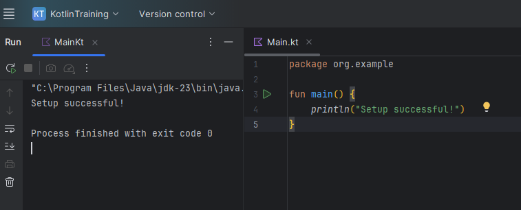

# Task Screenshots

This repository contains the required screenshots for the technical task.

## Folder Structure

```
.
├── screenshots/
│   ├── screenshot1.png
│   ├── screenshot2.png
│   └── ...
```

## Description

All screenshots have been saved inside the `screenshots/` folder as requested.  
They demonstrate the steps and output relevant to the task requirements.

## Screenshots Preview



