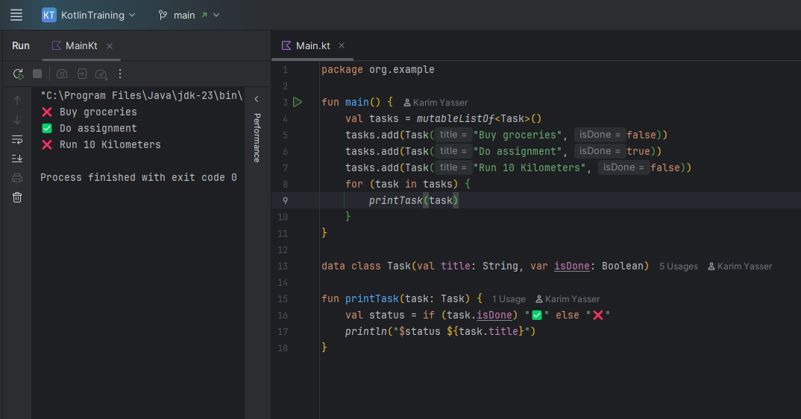

# Task Screenshots

This repository contains the required screenshots for the technical task.

## Folder Structure

```
.
├── screenshots/
│   ├── screenshot1.png
│   ├── screenshot2.png
│   └── ...
```

## Description

All screenshots have been saved inside the `screenshots/` folder as requested.  
They demonstrate the steps and output relevant to the task requirements.

## Screenshots Preview

Below are some of the screenshots included in this repo:




> Note: If the images do not appear correctly on GitHub, ensure the filenames and paths are correct.

Feel free to reach out if anything needs to be clarified or updated.
